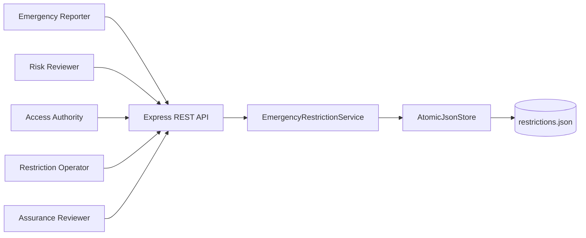
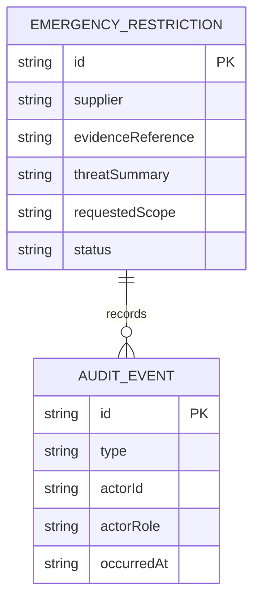
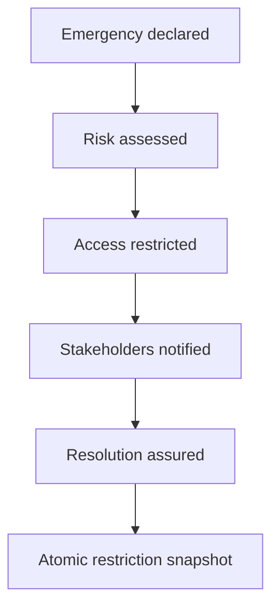
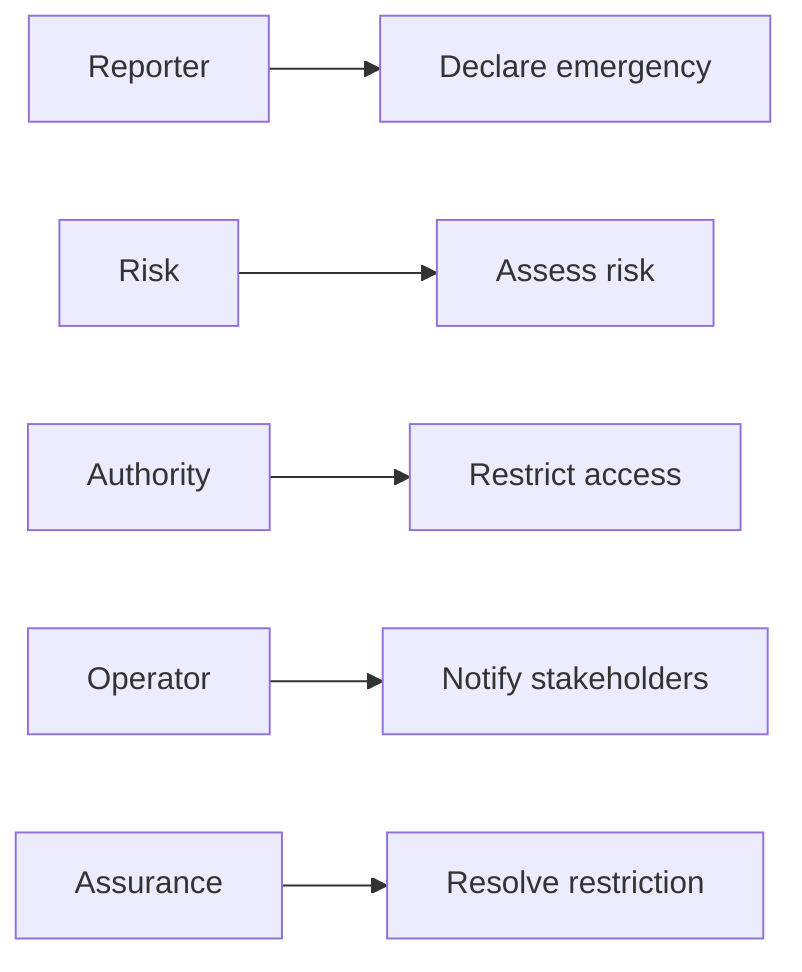
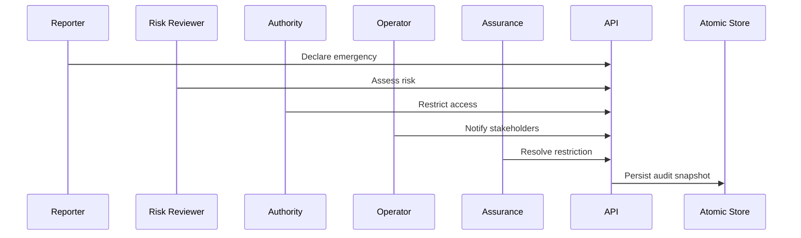

# Supplier Evidence Access Emergency Restriction Control Platform

## The Problem

An active threat to supplier evidence access requires a fast, accountable restriction that prevents further exposure while preserving a defensible decision record. Informal emergency action can leave uncertainty over the risk assessment, approved scope, affected parties, and closure evidence.

## The Solution

This service governs an emergency supplier evidence restriction from declaration through risk assessment, authority restriction, stakeholder notification, and assurance resolution. Role gates, ordered transitions, required references, audit events, and atomic persistence provide traceability under time-sensitive conditions.

## Live Demo and Tech Stack

Start the service and visit `http://localhost:65300/health` to confirm readiness. The stack uses Node.js 22, Express 5, ESM JavaScript, atomic JSON persistence, Vitest, and GitHub Actions.

| Layer | Implementation | Responsibility |
| --- | --- | --- |
| HTTP API | Express 5 | Emergency restriction lifecycle routes and errors |
| Control domain | ESM JavaScript | Role gates, state rules, and audit events |
| Persistence | Node file system | Temporary snapshot and atomic rename |
| Verification | Vitest and GitHub Actions | Domain tests and continuous integration |

## Local Setup and Run Instructions

```bash
git clone https://github.com/kholipha-ahmmad-al-amin/supplier-evidence-access-emergency-restriction-control-platform.git
cd supplier-evidence-access-emergency-restriction-control-platform
npm install
npm test
npm start
```

The service binds to `0.0.0.0:65300` for approved local area network use.

## System Documentation

### System Architecture Diagram


### Entity-Relationship Diagram


### Data Flow Diagram


### Use Case Diagram


### Sequence Diagram


## Owner

Created and maintained by Kholipha Ahmmad Al-Amin.

Software Engineer and AI Specialist

Founder and CEO of EquiSaaS BD

Principal Consultant at AR IT Consultancy

Full Stack Developer and SaaS Product Builder

### Official links

Portfolio: https://kholipha-ahmmad-al-amin.equisaas-bd.com/

GitHub: https://github.com/kholipha-ahmmad-al-amin

LinkedIn: https://www.linkedin.com/in/kholipha-ahmmad-al-amin

X: https://x.com/al_amin5519

Facebook: https://www.facebook.com/kholipha.ahmmad.al.amin

Instagram: https://www.instagram.com/kholipha.ahmmad.al.amin

## Ownership

This project was created and is maintained by Kholipha Ahmmad Al-Amin.

